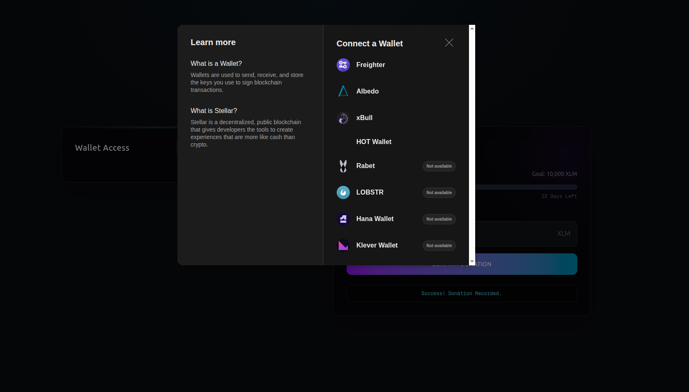
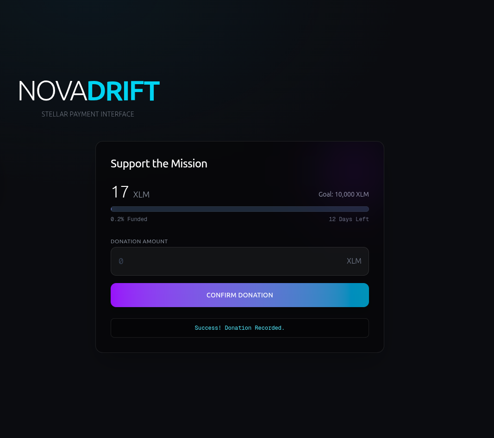
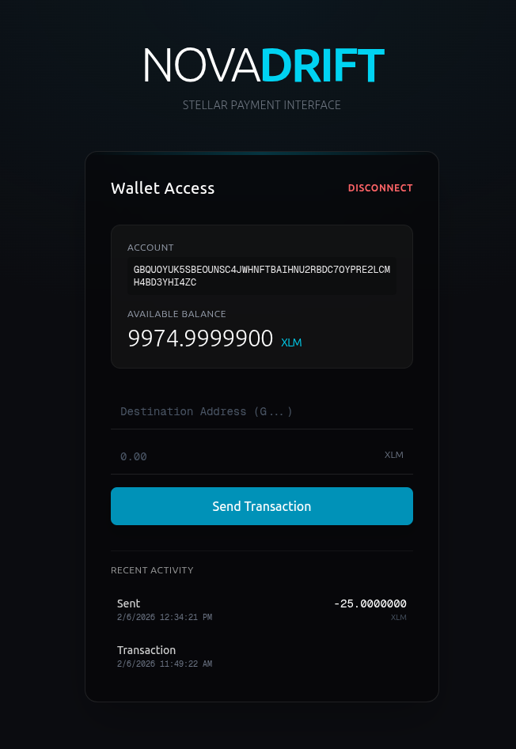
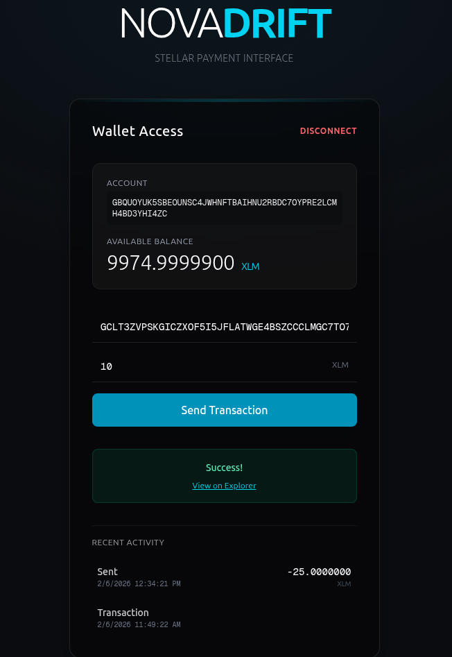
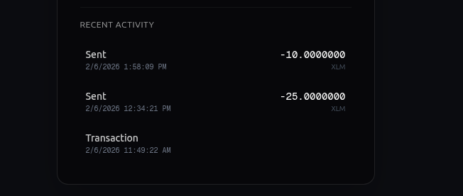

# NovaDrift - NovaFund Crowdfunding DApp

**NovaDrift** is a premium Stellar crowdfunding DApp built with [Next.js](https://nextjs.org) and [Tailwind CSS](https://tailwindcss.com). It features a modern "Deep Space" glassmorphism aesthetic, multi-wallet support via [StellarWalletsKit](https://github.com/AhaLabs/stellar-wallets-kit), and a Soroban smart contract for decentralized donation tracking.

---

## 🚀 Level 2 - Yellow Belt Submission

### Live Demo
> *Optional: Add your deployed link here*
>
> **Demo URL**: `novadrift-eosin.vercel.app`

---

### 📸 Screenshots

#### Wallet Options Available
*Shows the wallet connection modal with multiple wallet options (Freighter, xBull, etc.)*



#### Crowdfunding Interface
*Split view with wallet balance on left and donation interface on right*



---

### 📜 Deployed Smart Contract

| Network | Contract Address |
|---------|------------------|
| **Stellar Testnet** | `CB6N6KROTOYLECXYGUBVW6HMWUJYIOLDKLYYRBO4RRAQINS4PMP3SIWI` |

**View on Stellar Expert**: [https://stellar.expert/explorer/testnet/contract/CB6N6KROTOYLECXYGUBVW6HMWUJYIOLDKLYYRBO4RRAQINS4PMP3SIWI](https://stellar.expert/explorer/testnet/contract/CB6N6KROTOYLECXYGUBVW6HMWUJYIOLDKLYYRBO4RRAQINS4PMP3SIWI)

---

### 🔗 Example Transaction Hashes

| Description | Transaction Hash | Explorer Link |
|-------------|------------------|---------------|
| Contract Deployment | `6503b846213398cf9231583100ca0cce36dba2bc244e48a002d328c8ee7bcd26` | [View](https://stellar.expert/explorer/testnet/tx/6503b846213398cf9231583100ca0cce36dba2bc244e48a002d328c8ee7bcd26) |
| Contract Initialization | `758bf4b2a4d11660616ee9c7f69cad33239f9c0cb51b6319cdc1ca5f91e8effe` | [View](https://stellar.expert/explorer/testnet/tx/758bf4b2a4d11660616ee9c7f69cad33239f9c0cb51b6319cdc1ca5f91e8effe) |
| Donation Transaction | *Add after successful donation* | *Link* |

---

## Features

- **Multi-Wallet Support**: Connect via Freighter, xBull, Albedo, and more using StellarWalletsKit.
- **Real-time Balance**: View your current XLM balance.
- **Crowdfunding Interface**: Donate to a cause with real-time progress tracking.
- **Smart Contract Integration**: Donations are recorded on-chain via a Soroban contract.
- **Transaction History**: View your recent incoming and outgoing payments.
- **Professional UI**: Fully responsive, dark-mode accessible interface with refined typography (Geist).

---

## Getting Started

### Prerequisites

- Node.js (v18+)
- Rust & Soroban CLI (for contract development)
- [Freighter Wallet Extension](https://www.freighter.app/) installed in your browser.
- A Freighter account switched to **Testnet**.

### Installation

1.  Clone the repository:
    ```bash
    git clone https://github.com/Srizdebnath/novadrift.git
    cd novadrift
    ```

2.  Install dependencies:
    ```bash
    npm install
    ```

3.  Run the development server:
    ```bash
    npm run dev
    ```

4.  Open [http://localhost:3000](http://localhost:3000) with your browser.

## Screenshots

### Wallet Connected State
*Shows the wallet connected with the account address and balance.*




### Successful Transaction
*Shows the success feedback and transaction hash link.*




### Recent Activity
*Displays the list of recent transactions.*




## Tech Stack

- **Framework**: Next.js 16 (App Router)
- **Styling**: Tailwind CSS v4, Glassmorphism
- **Blockchain**: Stellar SDK, StellarWalletsKit, Soroban
- **Smart Contract**: Rust / Soroban SDK
- **Fonts**: Geist Sans & Mono

---

## Smart Contract Details

**Contract Name**: `nova_fund`

**Functions**:
| Function | Description |
|----------|-------------|
| `initialize(target, deadline)` | Sets the crowdfunding goal and deadline |
| `donate(donor, amount)` | Records a donation from a user |
| `get_state()` | Returns current target, raised amount, deadline, and state |

**Source Code**: `contracts/nova_fund/contracts/nova_fund/src/lib.rs`

---

## Recipient Wallet

All donations are sent to:
```
GCLT3ZVPSKGICZXOF5I5JFLATWGE4BSZCCCLMGC7TO7DJ7IC3U2ZBRUG
```

---

